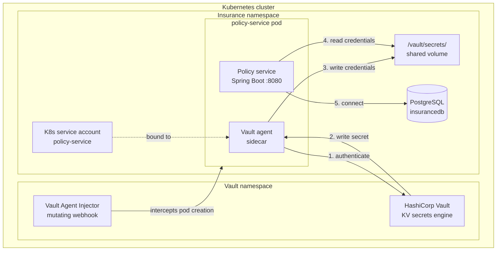

# Kubernetes Vault Secrets Management
> Production-grade secrets injection for Spring Boot microservices

## The Problem

In regulated environments insurance platforms, fintech APIs Spring Boot services connect to databases using credentials stored in `application.properties`, environment variables, or base64-encoded Helm values.

**Base64 is not encryption.** One compromised pod exposes your entire database.

Real breaches caused by credential exposure:
- **Scotiabank** — customer accounts compromised, September 2019
- **SolarWinds** — supply chain attack started by a hacked server password, December 2020
- **NVIDIA** — code-signing certificate leaked, February 2022
- **Uber** — corporate data leaked through 3rd-party standing privileges, December 2022

## The Solution

A secrets management pattern where:
- ✅ Credentials **never** enter the repository
- ✅ Credentials **never** appear in Kubernetes manifests
- ✅ Secrets **rotate** without restarting pods
- ✅ Every access is **audited**

## Architecture



## Flow

1. Pod starts → Vault Agent Injector intercepts via mutating webhook
2. Vault Agent sidecar authenticates using the pod's K8s service account token
3. Vault validates the service account against its Kubernetes auth backend
4. Vault Agent writes credentials to a shared in-memory volume `/vault/secrets/`
5. Spring Boot reads credentials from files — zero hardcoding, zero leaks
6. Secret rotation in Vault propagates automatically — no pod restart required

## Stack

| Component | Tool | Purpose |
|-----------|------|---------|
| Local K8s | kind | Cluster runtime |
| Secret Store | HashiCorp Vault | Credential management |
| Database | PostgreSQL | Data persistence |
| Application | Spring Boot | Policy Service API |
| Injector | Vault Agent Sidecar | Runtime secret injection |

## Project Structure

| Path | Description |
|------|-------------|
| `app/policy-service/` | Spring Boot insurance policy API |
| `app/policy-service/Dockerfile` | Multi-stage build, non-root user |
| `k8s/vault/` | Vault Helm values |
| `k8s/postgres/` | PostgreSQL manifests |
| `k8s/app/` | Policy service Kubernetes manifests |
| `scripts/setup-vault.sh` | Repeatable Vault configuration |
| `docs/architecture.md` | Architecture documentation |
| `kind-config.yaml` | Local cluster config |"""


## Getting Started

**Prerequisites:** Docker, kind, kubectl, helm

```bash
# 1. Create the cluster
kind create cluster --config kind-config.yaml

# 2. Install Vault
helm repo add hashicorp https://helm.releases.hashicorp.com
helm install vault hashicorp/vault \
  --namespace vault --create-namespace \
  --values k8s/vault/values.yaml

# 3. Deploy PostgreSQL
kubectl apply -f k8s/postgres/postgres.yaml

# 4. Configure Vault
./scripts/setup-vault.sh

# 5. Deploy the Policy Service
kubectl apply -f k8s/app/policy-service.yaml
```

## The Wow Moment

Rotate the database password in Vault — the app picks it up with **zero pod restarts:**

```bash
# Rotate in Vault
kubectl exec -n vault vault-0 -- vault kv put secret/insurance/policy-service \
  db_username="insurance_user" \
  db_password="new-password"

# Watch the Vault Agent rewrite the credentials file automatically
kubectl exec -n insurance <pod> -c vault-agent \
  -- cat /vault/secrets/db-credentials.properties
```

## What This Covers

| Secrets Management Pillar | Status |
|--------------------------|--------|
| Secrets separate from code | ✅ |
| Automated secret injection | ✅ |
| Least privilege access | ✅ |
| Secret rotation | ✅ |
| Audit trail via Vault | ✅ |
| Secrets inventory dashboard | 🔜 Project 2 |
| Unauthorized access alerting | 🔜 Project 2 |

## Series

This is **Project 1** in a cloud-native engineering series:
- **Project 1 — Secrets Management**
- **Project 2 — Observability** (Prometheus + Grafana + Loki)
- **Project 3 — GitOps** (ArgoCD)
- **Project 4 — Capstone** (all three combined)

---

Built by [Beldine Oluoch](https://github.com/Bels3) · [Medium](https://medium.com/@beldine3) · [LinkedIn](https://www.linkedin.com/in/beldineoluoch)
